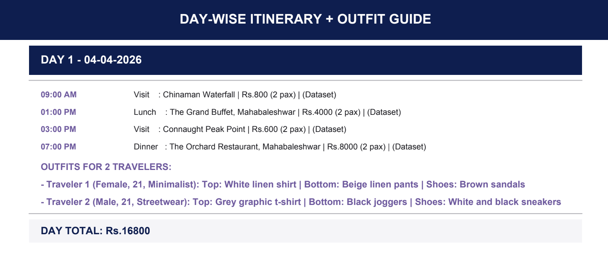
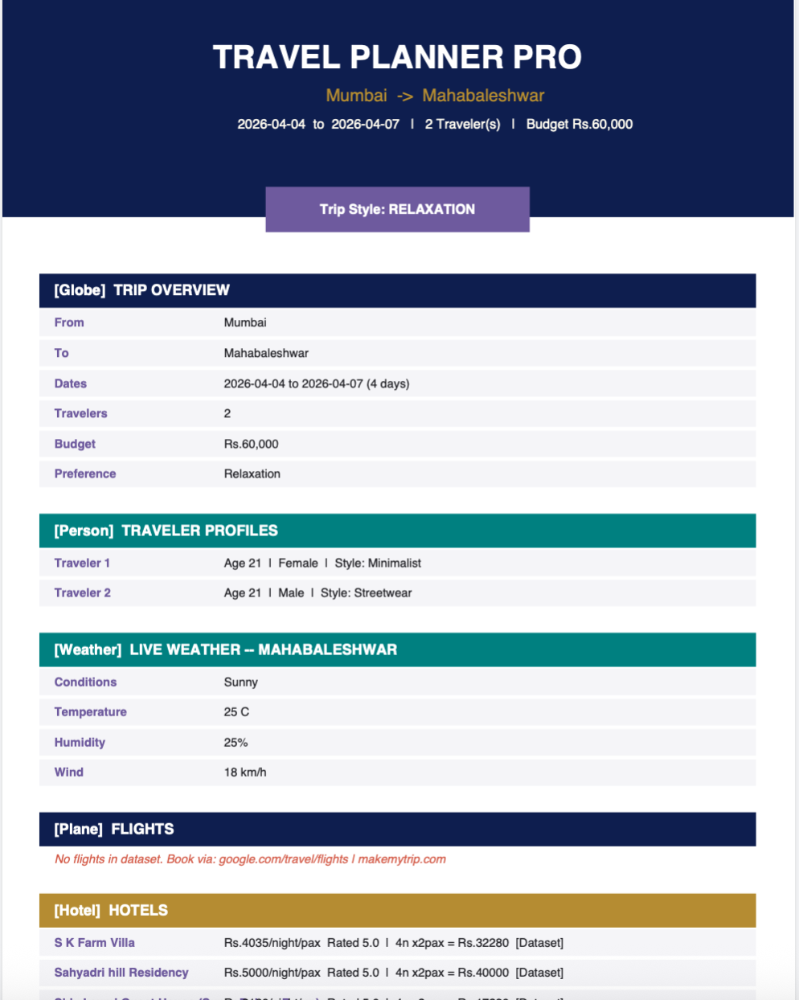

# GenAI Travel Planner: Intelligent Itinerary and Recommendation System

## Overview

GenAI Travel Planner is an AI-powered travel recommendation and itinerary generation system that helps users plan trips efficiently. The application combines travel datasets, real-time travel information, and Large Language Models (LLMs) to generate personalized itineraries, budget estimates, hotel recommendations, restaurant suggestions, and travel insights.

The project leverages Generative AI to create customized travel plans based on user preferences, destination, duration, and budget constraints.

## Features

### Personalized Itinerary Generation
- Generates customized preference based travel itineraries
- Provides day-wise travel schedules
- Recommends attractions and activities

### Budget Planning
- Estimates trip expenses
- Provides budget breakdowns
- Suggests cost-effective travel options

### Hotel Recommendations
- Recommends hotels based on destination and budget
- Utilizes hotel datasets for matching and ranking
- Provides accommodation-related insights

### Restaurant Recommendations
- Suggests restaurants based on location and preferences
- Uses restaurant datasets for recommendation generation
- Supports cuisine-based exploration

### Weather-Aware Travel Planning
- Integrates weather information into travel recommendations
- Assists users in planning destination activities

### AI-Powered Travel Assistance
- Uses Generative AI for personalized travel guidance
- Generates travel recommendations and destination insights based on preference
- Creates detailed itinerary descriptions with PDF Generation

## Technologies Used

### Programming Language
- Python

### Libraries and Frameworks
- Pandas
- NumPy
- Requests
- Groq
- OpenPyXL
- FPDF

### APIs
- Groq API
- OpenTripMap API
- Weather APIs

### Development Environment
- Google Colab
- Jupyter Notebook

## Datasets

The project utilizes multiple travel-related datasets, including:

### Hotel Dataset (HotelData.csv)
- Hotel information
- Ratings
- Pricing details
- Location information

### Restaurant Dataset (swiggy.csv)
- Restaurant details
- Cuisine categories
- Ratings and reviews
- Cost information

### Flight Dataset (Data_Train.xlsx)
- Airline information
- Source and destination details
- Fare information
- Travel attributes

## Project Structure

```text
travel-planner/
│
├── travel_planner.ipynb
├── datasets/
│   ├── HotelData.csv
│   ├── swiggy.csv
│   └── Data_Train.xlsx
│
├──  screenshots/
│   ├── homepage_output(1).png
│   ├── homepage_output(2).png
│   └── travel_plan_pdf.png
│   └── itinerary_output.png
│
├── README.md
├── requirements.txt
└── .gitignore
```
## Application Preview

### Home Page

.png) 
.png)

### Itinerary Output



### Generated Travel Guide PDF



## Future Enhancements

- Streamlit-based web application
- Interactive map integration
- Real-time flight recommendations
- AI travel chatbot
- Multi-language support
- Enhanced recommendation engine

